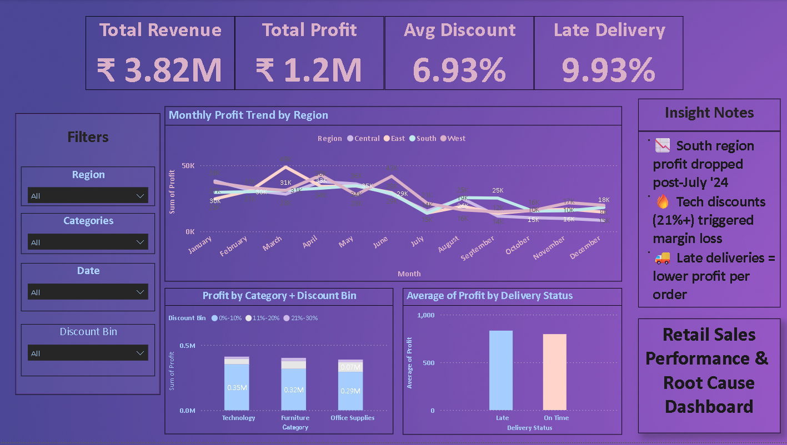

# 🧾 Retail Sales Performance & Root Cause Dashboard

This project showcases an interactive **Power BI dashboard** backed by Python EDA to uncover insights and business drivers behind retail performance.

---

## 🔍 Summary of Insights

- 📉 South region profits dropped significantly after July 2024
- 🔥 Tech products with **>21% discount** experienced margin losses
- 🚚 Late deliveries correlated with a lower average profit per order

---

## 💼 Business Context

The dashboard was built for a retail business to:
- Track performance KPIs (revenue, profit, discount rate, delivery delays)
- Detect operational inefficiencies
- Understand why margins dropped over time
- Suggest tactical levers for profit recovery

---

## 📁 Project Structure

| File | Description |
|------|-------------|
| `Retail Sales Performance & Root Cause Dashboard.pbix` | Power BI dashboard with filters and visualizations |
| `retail_sales_clean.csv` | Cleaned dataset used for building the dashboard |
| `EDA_RootCause_Analysis.ipynb` | Python notebook for early-stage data exploration |
| `dashboard_preview.png` | Static preview of the dashboard |
| `README.md` | This file |

---

## 📊 Dashboard Preview

---

## ⚙️ Tools & Technologies

- Power BI
- Python (pandas, matplotlib)
- Jupyter Notebook
- Excel (for intermediate cleaning and binning)

---

## 👨‍💻 Author

**Appu Anand**  
Data Analyst | 2 YOE  
📧 appu12anand@gmail.com  
📍 India

---

> 🧠 This project is part of a professional data analyst portfolio — focused on actionable insights and root cause analysis.
