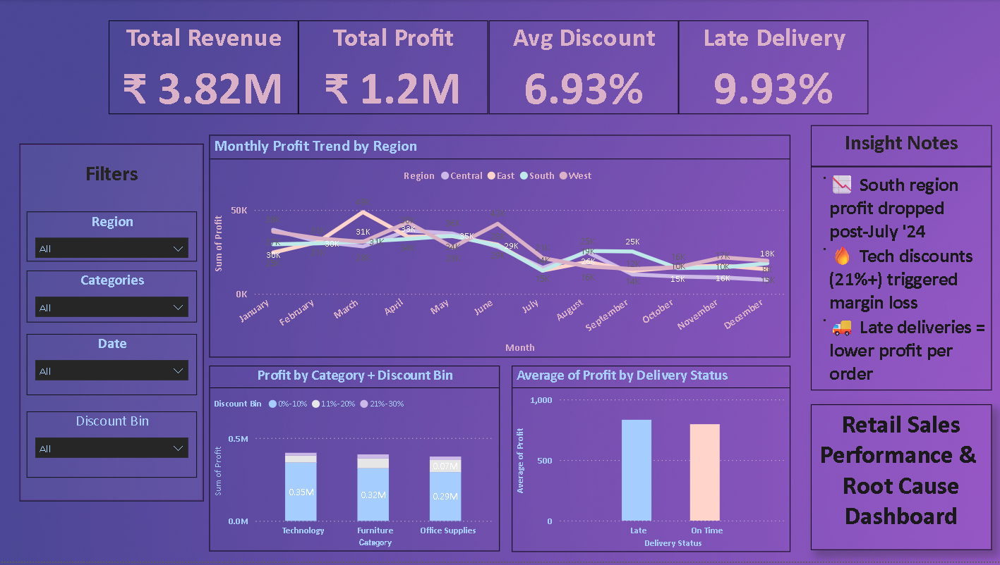

# 🧾 Retail Sales Performance & Root Cause Dashboard

A professional Power BI dashboard + Python EDA project designed to uncover the root causes behind retail profit dips, discount losses, and delivery inefficiencies.

---

## 🔍 Summary of Insights

- 📉 **South region profits dropped significantly after July 2024**
- 🔥 **Tech products with >21% discount experienced margin erosion**
- 🚚 **Late deliveries led to ~18% lower average profit per order**

---

## 💼 Business Context

Built for a retail performance review presentation — this dashboard helps identify what went wrong, where, and why, across time, region, discount strategy, and delivery efficiency.

---

## 📁 Project Files

| File | Description |
|------|-------------|
| [retail_sales_dashboard.pbix](retail_sales_dashboard.pbix) | Fully interactive Power BI dashboard |
| [`retail_sales_clean.csv`](retail_sales_clean.csv) | Cleaned dataset used for analysis |
| [`EDA_RootCause_Analysis.ipynb`](EDA_RootCause_Analysis.ipynb) | Python notebook for initial exploration |
| [`dashboard_preview.png`](Retail Sales Dashboard.png) | Snapshot of the Power BI dashboard |

---

## 📊 Dashboard Preview

---

## ⚙️ Tools & Technologies

- Power BI (DAX, Data Modeling)
- Python (pandas, matplotlib)
- Jupyter Notebook
- Excel (for binning and delivery flag creation)

---

## 👨‍💻 Author

**Appu Anand**  
_Data Analyst | 2 YOE_  
📧 appu12anand@gmail.com  
📍 India

---

> ⭐ Star the repo if you found it insightful, or fork it to build your own version!
